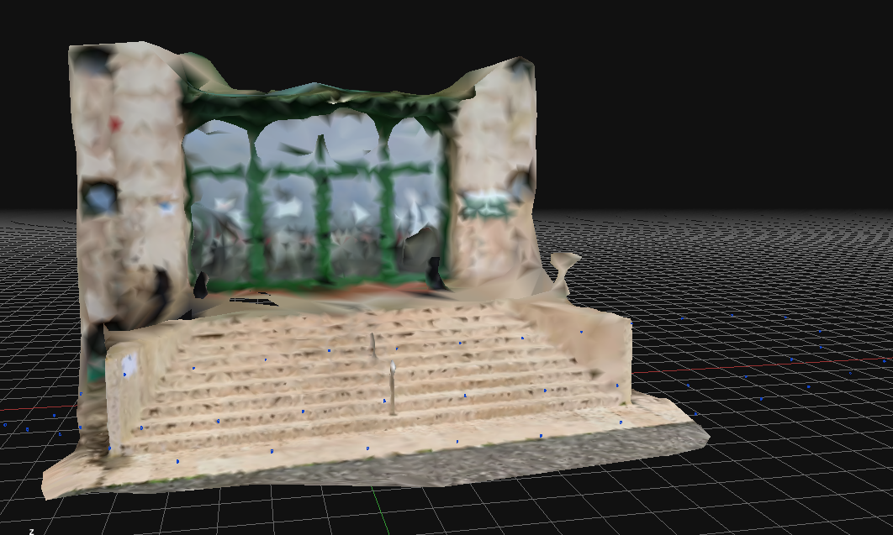
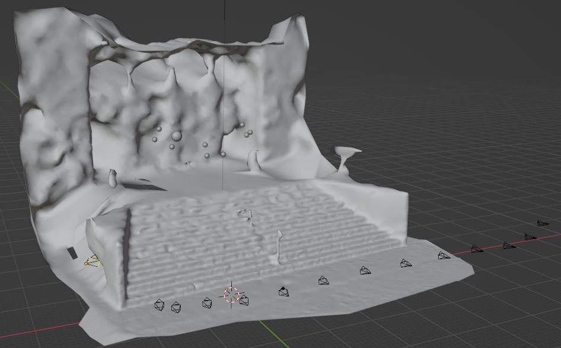
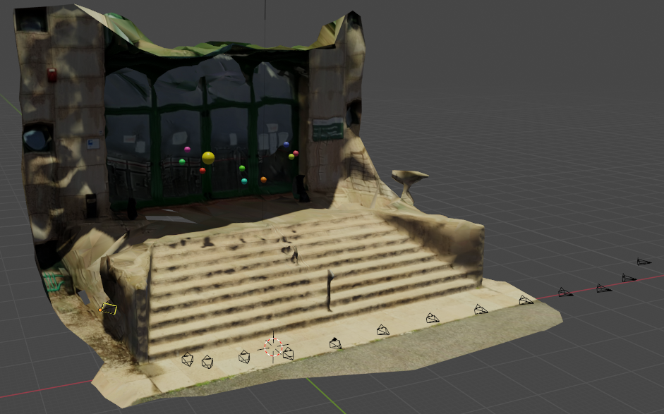

# Computer_Vision
Valentini Michel's exam project of Computer Vision about camera pose estimation in a 3d model. 
Fist step is take images from the environment to recustruct, upload images in Zephyr and create the 3d model. 

 

   
 

 
Then, export the mesh, texture and camera parameters in a folder used by Blender where has been wrote a script to upload the mesh and camera parameters in a new scene matching the camera's attribute in Zephyr with Blender's attribute.

Here, a camera has been created for each camera parameters file from Zephyr, and the values for focal length, sensor width, height, the shift on x and y, and finally, the camera's position and rotation have been correctly set with Blender's world.

 

   
 

At the end is be add objects like a sphere in the scene to create a example of vistual reality. 

 

   
 

Here is show the final result about two different cameras in different position and rotation that display the animation: 

  

  

